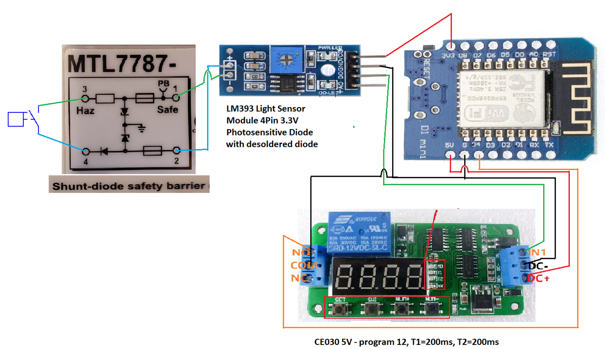

# gas-meter-for-homeassistant
<b>gas meter for homeassistant</b>

#code in "gas-meter-for-homeassistant.yaml" file is based on: https://github.com/klaasnicolaas/home-assistant-glow/blob/main/home_assistant_glow.yaml

The idea of reading the gas meter indications arose as a result of another project: https://github.com/klaasnicolaas/home-assistant-glow/blob/main/home_assistant_glow.yaml

During work, I was modifying the code available in the above-mentioned repository.

Below I will try to describe how I perform the gas meter reading. In my case it is the Apator Metrix UG G4 gas meter.

Impuls counter was connected to the gas meter, the so-called „NI-3 pulse transmitter” which is dedicated to the above-mentioned gas meter. In short, it is a reed switch in a suitable housing, matching the gas meter socket.

In Poland, the possibility of connection should be agreed with the Polish Gas Company, the operator of the gas infrastructure. The company has agreed to read the pulses on the condition that the so-called Spark-proof barier will be installed. I bought an EATON galvanic barrier, model: "MTL7787-" at a popular auction site.

The first problem that I encountered in the implementation of the impulse counter was just the above-mentioned barrier that introduces additional resistance in the circuit with the reed switch. As a result, we have a "weak" mass. This impulse was insufficient for the popular ESP8266 or ESP32 systems. In order to solve it, I used a kind of "amplifier", which was created by desoldering the photosensitive diode from the LM393 chip. We already have a strong signal at its D0 output.

The second problem was too long short circuit time of the reed switch, eg when the counter stopped in the "0" position on the last dial. This short circuit may take hours unti gas is begin drawing up again. In order to solve this situation, I used the CE030 time module shown in the scheme with the program 12 set. T1 and T2 times were set to 200 ms.

The next step was to make connection between NO pin of the CE030 chip and for e.g. the D4 pin in WEMOS D1 mini. Code for ESPHome is available in the .yaml file.

Good luck with your implementation.

Regards

Scheme:

  

